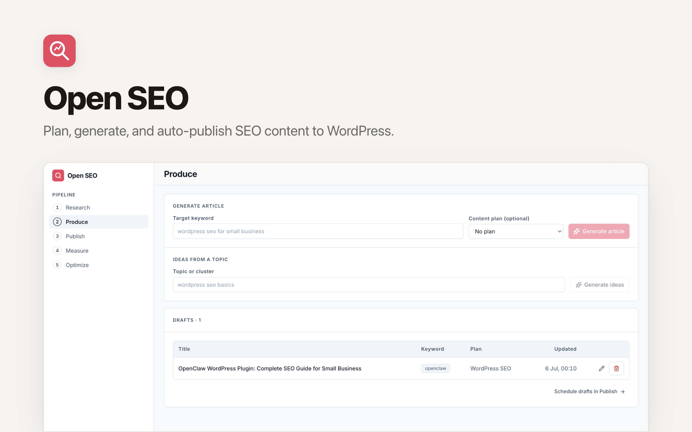

# Open SEO: The Open-Source Surfer & Frase Alternative

[](https://app.clawnify.com/deploy?repo=clawnify/open-seo)

An AI SEO content engine for WordPress. Plan topical clusters, generate people-first articles, and auto-publish them to your site on a schedule. Built with **Preact + Tailwind CSS + Hono + D1**. Deploys to Cloudflare Workers via [Clawnify](https://clawnify.com).

Think of it as an open-source alternative to **Surfer** or **Frase** — a content pipeline you can self-host and customize, wired straight into your own WordPress.

## Features

**Research**
- **Keyword discovery** — a seed topic → prioritized keyword opportunities with intent + difficulty, pulled from **live Google SERP data** (SerpAPI): real related searches and People-Also-Ask questions. No SerpAPI connected? It falls back to AI-estimated ideas, clearly labelled.
- **Competitor SERP** — a keyword → who currently ranks (live page-1 results) plus the content gaps searchers also ask about. Live-only — no model can know who ranks today.
- **Content plans** — group articles into topical clusters (pillar topic + target keyword + audience) to build authority.

**Produce**
- **Idea generation** — expand a cluster into a set of search-intent article titles.
- **Article generation** — turn a target keyword into a full, people-first article (title, meta description, semantic HTML body) via OpenRouter.
- One-click **Draft** from any discovered keyword flows straight into Produce.

**Publish**
- **Pipeline** — every article grouped by status: draft → scheduled → published → failed.
- **Calendar** — month grid of scheduled articles.
- **Auto-publish to WordPress** — schedule an article and the Clawnify queue fires it to your site's REST API at the chosen time; publish now with one click.

**Measure**
- **Pipeline stats + publishing cadence** — at-a-glance counts and a 30-day activity chart.
- **Keyword rankings** — check where your connected site currently ranks on Google for each published article's keyword, from **live SerpAPI results**. Positions are stored per article (top-3 / page-1 badges, best position, last checked) and refreshed on demand in bounded batches.

> **Roadmap:** Optimize (AI rewrite suggestions over search performance); Google Search Console clicks/impressions/CTR; and real search-volume/difficulty numbers via DataForSEO to enrich the AI-classified difficulty bands.

## How publishing works

Scheduling is owned by the **Clawnify managed queue** (`services.clawnify.com/queue`): saving a scheduled article enqueues a deferred job that calls this app's own `/api/internal/publish` at the scheduled time (HMAC-verified). That handler publishes the article to your **self-hosted WordPress** via the REST API using an Application Password.

**Credentials come from the WordPress you connect in Clawnify → Integrations** — not from anything hardcoded. Because `clawnify.json` declares `credentials: ["wordpress"]`, the builder resolves that connected credential from your org's vault at deploy time and injects it into the app as `WORDPRESS_SITE_URL` / `WORDPRESS_USERNAME` / `WORDPRESS_PASSWORD` Worker secrets. All of it is read in one seam — `src/server/wordpress.ts`. Locally, `.dev.vars` is just the stand-in for that same injection.

## How research works

Live search data comes from the **SerpAPI integration you connect in Clawnify → Integrations** — the app never holds an API key. `clawnify.json` declares `credentials: ["serpapi"]`, so the builder wires the credentials broker into the app; `src/server/research.ts` then pulls live Google results through the one SDK call the platform sanctions — `connect("serpapi", env).run("SERPAPI_SEARCH", …)` from [`@clawnify/connections`](https://www.npmjs.com/package/@clawnify/connections). Related searches and People-Also-Ask become keyword opportunities and content gaps; page-1 organic results become the competitor list. An AI pass then clusters and classifies intent + difficulty **over that real SERP** — grounded, not guessed.

Without a SerpAPI connection (e.g. local `pnpm dev`), keyword discovery degrades to an AI-estimated expansion (`source: "ai"`, clearly labelled — never invented numbers presented as live data); competitor analysis stays live-only.

The same connection powers **Measure's keyword rankings**: for each published article, `src/server/measure.ts` runs a live search for its keyword and records where your site's domain (from `WORDPRESS_SITE_URL`) sits in the page-1 results. Ranks are persisted on each post, so the dashboard reads stored positions instead of re-hitting the API on every view; checks run in bounded batches (least-recently-checked first) to respect Worker time and SerpAPI rate limits.

## Quickstart

```bash
git clone https://github.com/clawnify/open-seo.git
cd open-seo
pnpm install
pnpm dev
```

Open `http://localhost:5173`. The D1 schema is applied automatically on startup.

For local generation + publishing, fill `.dev.vars`:

```
OPENROUTER_API_KEY=sk-or-...
WORDPRESS_SITE_URL=https://your-site.com
WORDPRESS_USERNAME=your-wp-user
WORDPRESS_PASSWORD=xxxx xxxx xxxx xxxx   # WordPress → Users → Application Passwords
```

In production (deployed via Clawnify), all of these are injected automatically from your connected integrations — no keys in the app.

## Tech Stack

| Layer | Technology |
|-------|-----------|
| **Frontend** | Preact, TypeScript, Tailwind CSS v4, Vite |
| **Backend** | Hono (Cloudflare Worker) |
| **Database** | D1 (SQLite at the edge) |
| **Generation** | OpenRouter (`anthropic/claude-sonnet-4` by default, override via `SEO_MODEL`) |
| **Search data** | SerpAPI via Clawnify Integrations (`@clawnify/connections`), AI-estimated fallback |
| **Scheduling** | Clawnify managed queue |
| **Publishing** | WordPress REST API (Application Password) |
| **Icons** | Lucide |

Design follows the Clawnify Apps system — see `DESIGN.md`.

## Architecture

```
src/
  server/
    index.ts        -- Hono API: research, plans, posts, generate, publish, calendar, stats
    ai.ts           -- OpenRouter: article + idea generation + keyword classification
    research.ts     -- Keyword/competitor discovery seam (SerpAPI live + AI fallback)
    measure.ts      -- Live keyword rank tracking (reuses the SerpAPI seam)
    wordpress.ts    -- WordPress publish seam (credentials + REST)
    queue.ts        -- Clawnify managed-queue scheduling adapter
    db.ts           -- D1 adapter (@clawnify/db)
    schema.sql      -- content_plans + posts
  client/
    app.tsx         -- Root component with router
    components/     -- sidebar, dashboard, pipeline, calendar, plans, composer
    hooks/          -- use-app (state + CRUD), use-router (pushState)
```

### API Endpoints

| Method | Endpoint | Description |
|--------|----------|-------------|
| GET | `/api/status` | WordPress + AI + live-research connection state |
| POST | `/api/research/keywords` | Seed → keyword ideas (`source: live \| ai`) |
| POST | `/api/research/competitors` | Seed → live ranking competitors + content gaps |
| POST | `/api/measure/rankings/refresh` | Check + persist live Google positions (bounded batch) |
| GET/POST/PUT/DELETE | `/api/plans[/:id]` | Content plan CRUD |
| POST | `/api/ideas` | Article title ideas for a cluster |
| POST | `/api/generate` | Generate a full article draft |
| GET/POST/PUT/DELETE | `/api/posts[/:id]` | Article CRUD |
| GET | `/api/posts/calendar?month=YYYY-MM` | Articles grouped by day |
| POST | `/api/posts/:id/publish` | Publish now to WordPress |
| POST | `/api/internal/publish` | Scheduled delivery (queue → HMAC-verified) |
| GET | `/api/stats` | Pipeline stats |

## Deploy

```bash
npx clawnify deploy
```

## License

MIT
